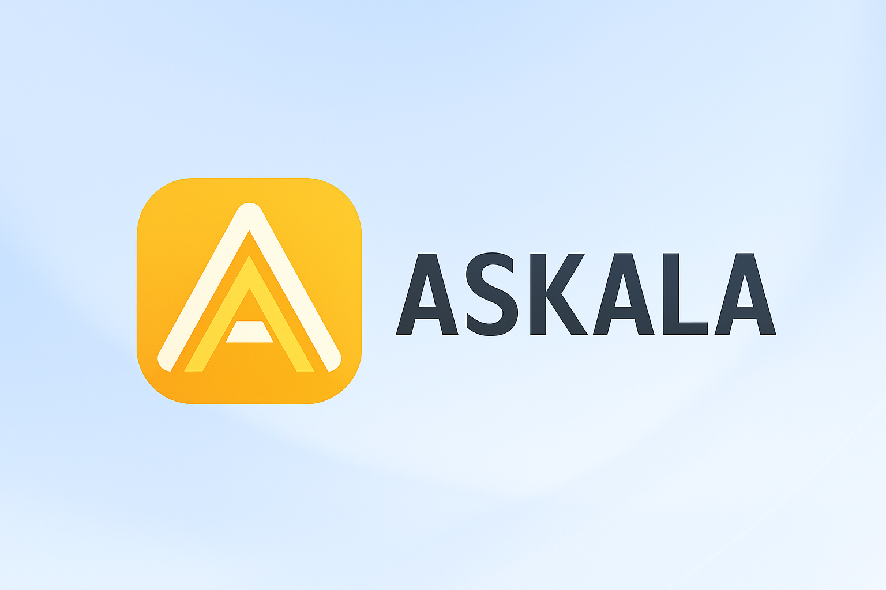

<div style="display:flex;flex-direction:column;">
  <a href="#">
    
  </a>

<br/>
<br/>

[](https://internetcomputer.org)
</div>

# Askala BaseApp

**Askala BaseApp** is an AI-powered learning platform built on the **Internet Computer Protocol (ICP)** using **Motoko** for the backend and **React + Vite** for the frontend. It delivers interactive Python learning modules, secure authentication, and progress tracking—fully decentralized and verifiable.

## Features

- Interactive Python lessons with rich MDX content
- Secure login using Internet Identity
- Tracks user progress per lesson
- AI-powered chat assistant for each topic
- Modern UI with Tailwind CSS

## ICP Building Blocks Used
Askala leverages key components of ICP technology to create a secure, decentralized learning experience:

- **🔐 Internet Identity (II)**
Askala uses Internet Identity (II), a privacy-preserving passwordless authentication system built on BLS threshold signatures and WebAuthn.  ➡️ This enables seamless and secure login for students without relying on a centralized identity provider.

- **🧠 On-chain Smart Contracts with Motoko**
The lesson metadata, user profiles, and progress tracking are all stored and managed directly in Motoko-based canister smart contracts—running on-chain with low latency and high throughput.Lessons are stored as structured metadata records (title, slug, tags, hash, etc.) Users’ learning history is maintained in persistent on-chain storage All updates (e.g., progress changes) are verified and recorded immutably.

- **🌐 Hosting Frontend on ICP (optional/extendable)**
While Askala currently serves the frontend from traditional infrastructure, it can be extended to serve the full React+Vite frontend directly from the chain—leveraging ICP’s low-latency, low-cost storage.

- **📡 (Upcoming) HTTP Outcalls (Optional Enhancement)**
Askala may later integrate HTTP outcalls—allowing canisters to directly fetch external data (e.g., AI inference results or third-party content) from off-chain APIs. This can further decentralize backend logic and reduce reliance on frontend requests.


## Local Development Setup

### Prerequisites

- [Node.js](https://nodejs.org/) (v22+)
- [DFX SDK](https://internetcomputer.org/docs/current/developer-docs/setup/install) (for ICP development)
- [npm](https://www.npmjs.com/) (v11+)

1. **Clone the Repository**

```sh
git clone https://github.com/chainrooks/askala_baseapp.git
cd askala_baseapp
```

2. **Install Dependencies**

```sh
npm install
```

3. **Start the Local ICP Replica**

```sh
dfx start --background
```

4. **Deploy Local**
```sh
dfx deploy --network=local
```

## Content & Deployment Workflow

1. **Content Change**  
   Update lesson content or metadata as needed (MDX files, lesson registry, dsb).

2. **Generate Hash**  
   Run the script to generate hashes of content and metadata::
   ```sh
   npm run build:content-hash
   ```

2. **Deploy Metadata To Backend Canister**  
   Run the script to deploy content to the canister backend
   ```sh
   npm run deploy:metadata
   ```

---

## Project Structure

- `src/askala_baseapp_backend/` – Motoko backend canister code
- `src/askala_baseapp_frontend/` – React frontend code
- `build-scripts/` – Scripts for content registry and deployment
- `deployment/` – Generated lesson metadata for backend

## Learn More

- [ICP Developer Docs](https://internetcomputer.org/docs/current/developer-docs/setup/deploy-locally)
- [Motoko Language Guide](https://internetcomputer.org/docs/current/motoko/main/motoko)

---

For any issues, please check the documentation or reach out to the ICP developer