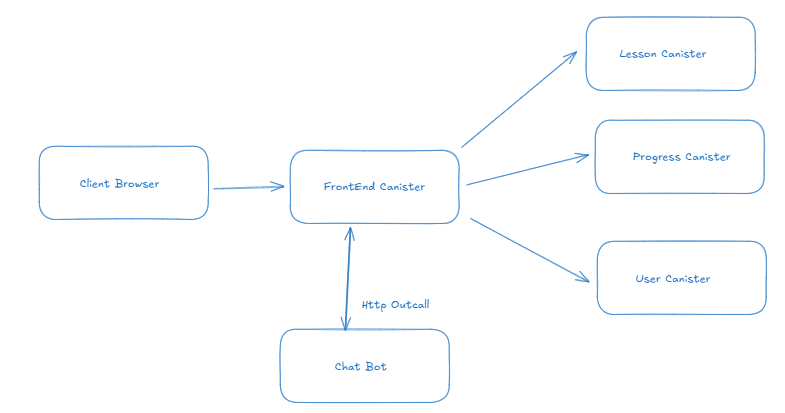

<div style="display:flex;flex-direction:column;">
  <a href="#">
    
  </a>

<br/>
<br/>

[](https://internetcomputer.org)
</div>

# Askala BaseApp

**Askala BaseApp** is an AI-powered learning platform built on the **Internet Computer Protocol (ICP)** using **Motoko** for the backend and **React + Vite** for the frontend. It delivers interactive Python learning modules, secure authentication, and progress tracking—fully decentralized and verifiable.

## Table of Contents

- [Features](#features)
- [ICP Building Blocks Used](#icp-building-blocks-used)x
- [Technical Architecture](#technical-architecture)v
- [Overview](#overview)
- [Local Development Setup](#local-development-setup)
- [Content & Deployment Workflow](#content--deployment-workflow)
- [AI Local Developement](#ai-local-developement)
- [Roadmap](#Roadmap)
- [Project Structure](#project-structure)

## Features

- Interactive Python lessons with rich MDX content
- Secure login using Internet Identity
- Tracks user progress per lesson
- AI-powered chat assistant for each topic
- Modern UI with Tailwind CSS

## ICP Building Blocks Used
Askala leverages key components of ICP technology to create a secure, decentralized learning experience:

- **🔐 Internet Identity (II)**
Askala uses Internet Identity (II), a privacy-preserving passwordless authentication system built on BLS threshold signatures and WebAuthn.  ➡️ This enables seamless and secure login for students without relying on a centralized identity provider.

- **🧠 On-chain Smart Contracts with Motoko**
The lesson metadata, user profiles, and progress tracking are all stored and managed directly in Motoko-based canister smart contracts—running on-chain with low latency and high throughput.Lessons are stored as structured metadata records (title, slug, tags, hash, etc.) Users’ learning history is maintained in persistent on-chain storage All updates (e.g., progress changes) are verified and recorded immutably.

- **🌐 Hosting Frontend on ICP (optional/extendable)**
While Askala currently serves the frontend from traditional infrastructure, it can be extended to serve the full React+Vite frontend directly from the chain—leveraging ICP’s low-latency, low-cost storage

- **📡 (Upcoming) HTTP Outcalls (Optional Enhancement)**
Askala may later integrate HTTP outcalls—allowing canisters to directly fetch external data (e.g., AI inference results or third-party content) from off-chain APIs. This can further decentralize backend logic and reduce reliance on frontend requests.

- **💸 ICP Ledger**
Askala leverages the ICP Ledger canister, the core blockchain component that securely records balances, transfers, and token history on-chain.
➡️ This enables transparent handling of learning credits or tokenized rewards for students—where minting, transfers, and fees are immutably verified by the ledger canister with the same security guarantees as ICP itself


## Technical Architecture

## Overview
<div style="display:flex;flex-direction:column;">
  <a href="#">
    
  </a>
  
<br/>
<br/>

This architecture uses ICP as the backend platform with several canisters: **FrontEnd**, **Lesson**, **Progress**, and **User**. React is used on the browser side as the UI. The **FrontEnd Canister** manages communication between canisters and performs HTTP outcalls to the Chat Bot, which is connected to an LLM API for AI.

## Local Development Setup

### Prerequisites

- [Node.js](https://nodejs.org/) (v22+)
- [DFX SDK](https://internetcomputer.org/docs/current/developer-docs/setup/install) (for ICP development) (v0.28)
- [npm](https://www.npmjs.com/) (v11+)
- [mops](https://internetcomputer.org/docs/tutorials/developer-liftoff/level-3/3.1-package-managers) ()

1. **Clone the Repository**

```sh
git clone https://github.com/chainrooks/askala_baseapp.git
cd askala_baseapp
```

2. **Install Dependencies**

```sh
npm install
```


23 **Install Mops**

```sh
mops sources && mops install 
```

4. **Start the Local ICP Replica**

```sh
dfx start --background
```

5. **Deploy Local**
```sh
dfx deploy --network=local
```

## Local Dev Initiate Ledger

1. **Create minter as admin**
```bash 
dfx identity use minter
export MINTER_ACCOUNT_ID=$(dfx ledger account-id)
```

2. **Createidentity default `(DevAccount)`**
```bash
dfx identity new DevAccount
dfx identity use DevAccount
export DEFAULT_ACCOUNT_ID=$(dfx ledger account-id)
```

3. **Initialize Ledger with `Minter`
```bash
dfx deploy --specified-id ryjl3-tyaaa-aaaaa-aaaba-cai icp_ledger_canister --argument "
(variant {
  Init = record {
    minting_account = \"${MINTER_ACCOUNT_ID}\";
    initial_values = vec {
      record {
        \"${DEFAULT_ACCOUNT_ID}\";
        record {
          e8s = 10_000_000_000 : nat64;
        };
      };
    };
    send_whitelist = vec {};
    transfer_fee = opt record {
      e8s = 10_000 : nat64;
    };
    token_symbol = opt \"LICP\";
    token_name = opt \"Local ICP\";
  }
})
"
```

## Content & Deployment Workflow


1. **Content Change**  
   Update lesson content or metadata as needed (MDX files, lesson registry).

2. **Generate Hash**  
   Run the script to generate hashes of content and metadata::
   ```sh
   npm run build:content-hash
   ```

2. **Deploy Metadata To Backend Canister**  
   Run the script to deploy content to the canister backend
   ```sh
   npm run deploy:metadata
   ```

> **Note:**  
> Make sure you have run the **Deploy Local** process (`dfx deploy --network=local`) first before following the steps in the **Content & Deployment Workflow** section below. 

> It is important that the backend canister is up and ready to accept metadata or content changes.
---

## Roadmap
- [x] Implement ICP Account with LLM Chatbot
- [ ] Build simple analytics dashboard for user engagement and lesson performance
- [ ] Add multilingual content support (starting with Bahasa Indonesia & English)
- [ ] Introduce freemium features, premium course tracks, and contributor token rewards.
- [ ] Personalized tutoring via LLM with context-aware suggestions.
- [ ] Reward learners via ICRC-1 token and issue DIP721 NFT credentials
- [ ]  Enable discussion threads per lesson

## AI Local Developement

see [Askala AI Repository](https://github.com/chainrooks/askala_ai)

## Project Structure

- `src/backend/` – Askala Backend Code
- `src/askala_baseapp_frontend/` – React frontend code
- `build-scripts/` – Scripts for content registry and deployment
- `deployment/` – Generated lesson metadata for backend